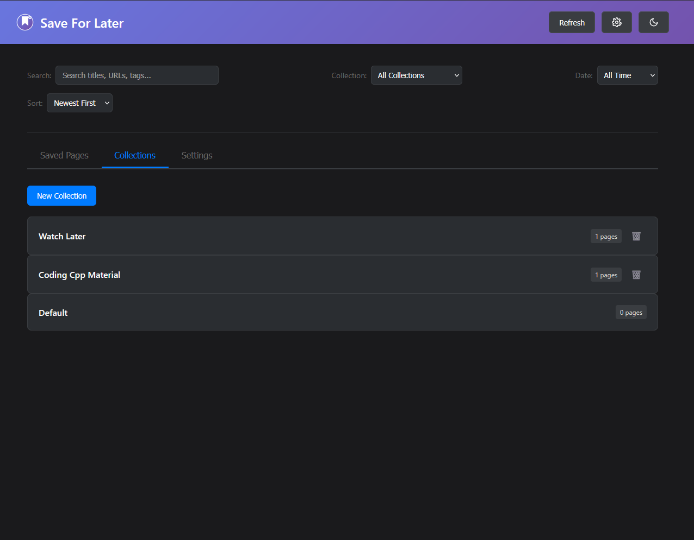
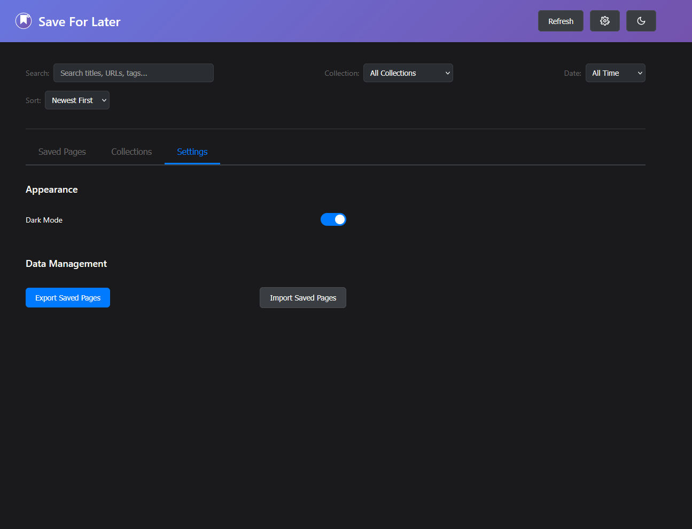

# Save For Later - Firefox Extension

Due to the recent announcement for the closure of Pocket, I decided to create my own bookmark manager.
I liked how Pocket worked, and I especially liked the idea of being able to save webpages for later viewing, because honestly I don't like using the build in browser bookmarks.
This firefox extension allows you to save web pages for later viewing with collections features.

## Features

- **Right-click to save**: Right-click on any webpage and select "Save For Later" to save it
- **Collections**: Organize saved pages into custom collections
- **Search & Filter**: Search through saved pages and filter by collections

## Installation
### Method 1: Get through the Mozilla Add-ons (Recomended) 
1. Open the Mozilla Add-ons Store
2. Search for [Save For Later For Firefox](https://addons.mozilla.org/en-US/firefox/addon/save-for-later-for-firefox/)
3. The extension will be installed and you can start using it

### Method 2: Load as Temporary Add-on (Development)

1. Clone Repo
2. Open Firefox and navigate to `about:debugging`
3. Click on "This Firefox" in the sidebar
4. Click "Load Temporary Add-on"
5. Select the `manifest.json` file from this directory
6. The extension will be loaded and you can start using it

## Usage

### Saving Pages
1. Navigate to any webpage you want to save
2. Right-click on the page
3. Select "Save For Later" from the context menu
4. The page will be saved with its title, URL, and favicon

### Managing Saved Pages
1. Click the extension icon in the toolbar
2. View all your saved pages in the main tab
3. Use the search bar to find specific pages
4. Filter by collections using the dropdown

### Creating Collections
1. Click the "New Collection" button in the extension popup
2. Enter a name for your collection
3. Click "Create"

## Browser Compatibility

This extension is designed for Firefox and uses the WebExtensions API. It may not work in other browsers without modifications.

## License

This project is open source and available under the MIT License. 